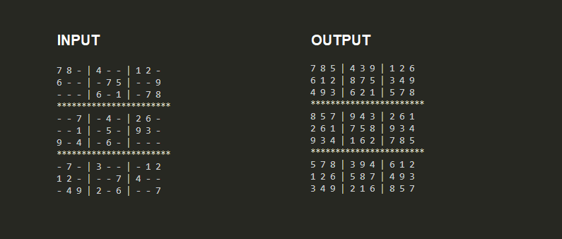

# Python Sudoku Solver using Backtracking #

## About Sudoku ##

**Sudoku (sūdoku, digit-single)(originally called Number Place) is a logic-based, combinatorial number-placement puzzle. In classic sudoku, the objective is to fill a 9×9 grid with digits so that each column, each row, and each of the nine 3×3 subgrids that compose the grid (also called "boxes", "blocks", or "regions") contain all of the digits from 1 to 9. The puzzle setter provides a partially completed grid, which for a well-posed puzzle has a single solution.**


>Algorithm (Rough Sketch) :-<br>

- Pick an empty position in the given sudoku.
- Try on any number on that position.
- Find the number that is most suitable in that position.
- Repeat above steps
- Backtrack if the given number isn't valid(suitable) for given sudoku board.
  
>Python Code :-

```Python
'''
Sudoku Solver - Solve given sudoku that is provides right value to the blank position in the sudoku.
'''

# Input as Sudoku Board

board = [
    [7, 8, '-', 4, '-', '-', 1, 2, '-'],
    [6, '-', '-', '-', 7, 5, '-', '-', 9],
    ['-', '-', '-', 6, '-', 1, '-', 7, 8],
    ['-', '-', 7, '-', 4, '-', 2, 6, '-'],
    ['-', '-', 1, '-', 5, '-', 9, 3, '-'],
    [9, '-', 4, '-', 6, '-', '-', '-', '-'],
    ['-', 7, '-', 3, '-', '-', '-', 1, 2],
    [1, 2, '-', '-', '-', 7, 4, '-', '-'],
    ['-', 4, 9, 2, '-', 6, '-', '-', 7]
]

# Showing board to the user

def print_board(bo):
    for i in range(len(bo)):
        if i%3==0 and i!=0:
            print('***********************')

        for j in range(len(bo[0])):
            if j%3==0 and j!=0:
                print('|', end=' ')
        
        # Printing Numbers        
            if j == 8:
                print(bo[i][j])
            else:
                print(str(bo[i][j])+" ",end ='')

           

# To find empty positions in given sudoku board

def find_empty(bo):
    for i in range(len(bo)):
        for j in range(len(bo[0])):
            if bo[i][j] == '-':
                return (i,j) # (row,col)
    return None

# To check that the given position is valid or not

def valid(bo, num, pos):
    
    # check respective row
    for i in range(len(bo[0])):
        if bo[pos[0]][i] == num and pos[1] != i:
            return False
    
    # check respective column
    for i in range(len(bo)):
        if bo[i][pos[1]] == num and pos[0] != i:
            return False

    # check respective 3 x 3 grid

    box_x = pos[1]//3
    box_y = pos[0]//3
    
    for i in range(box_y*3, box_y*3+3):
        for j in range(box_x*3, box_x*3+3):
            if bo[i][j] == num and (i,j) != pos:
                return False
    return True

# Solve function

def solve(bo):
    find = find_empty(bo)
    if not find: # Base condition
        return True
    else: # Backtrack
        row, col = find

    for i in range(1,10):
        if valid(bo, i, (row, col)):
            bo[row][col] = i

            if solve(bo):
                return True
            bo[row][col] = '-'
    return False

# Driver Function

print('------------ Given Sudoku Board -----------------\n')
print_board(board)
print('------------ __________________ -----------------\n')
print('Solving......\n3...\n2...\n1..\n--------Solution---------')
print('\n')
solve(board)
print_board(board)

```
 
## Image Of Input and Output :- ##
